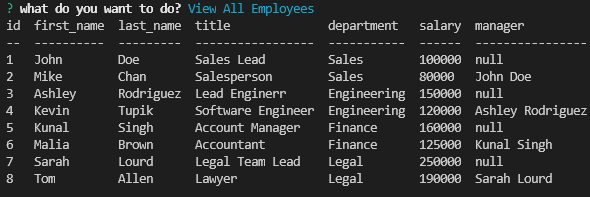
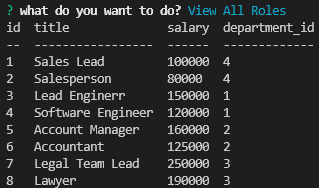
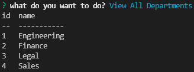
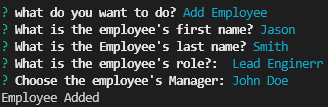
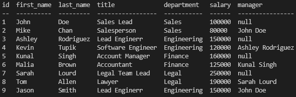
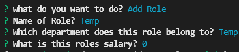
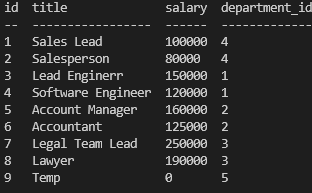
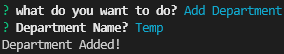
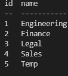
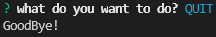

# SQL Employee Tracker

Demonstration of application in action located <a href="https://www.youtube.com/watch?v=JdLfQKYftWg">here</a>.

## Table of Contents
* [Installation](#installation)
* [Instructions](#instructions)

* [Questions](#questions)
* [License](#license)

## Description:
The purpose of this CLI application is to be able to manage an employee database. 

You can:
    
* View all employees
* View all departments
* View all roles
* Add an employee
* Add a department
* Add a role
* Update an employee's role

When you view all employees you will be greeted with a clean table joining the employees information, as well as the department they are attached to and the name of their manager if applicable.

## Installation
1. Clone the repo to your local machine
2. Run `npm i` to install all dependencies
3. Open SQL in your terminal
4. Run `source schema.sql` to build the employee database
5. Run `source seeds.sql` to seed the database
6. Open `index.js` in your terminal and run `node index.js` to start the application

## Instructions
1. After you install the application and run it using `node index.js` you will be greeted with multiple options for what you want to do. Selecting `View All Employees` will show you a table of all current employees in the database.

2. Selecting `View All Roles` will show you a table of all current roles in the database.

3. Selecting `View All Departments` will show you a table of all current departments in the database.

4. Selecting `Add Employee` will bring up several inputs for employee information.

5. When you finish answering the prompts for employee information, you will be shown the new table of current employees in the database.

6. Selecting `Add Role` will bring up several inputs for role information.

7. When you finish answering the prompts for role information, you will be shown the new table of current roles in the database.

8. Selecting `Add Department` will bring up several inputs for department information.

9. When you finish answering the prompts for department information, you will be shown the new table of current departments in the database.

10. Selecting `Quit` will stop the application and exit it.

## Questions
If you have any questions, contact me <a href="https://github.com/TheHebi" target="_blank">here</a>, or send me an email at nturcotte8@live.com.

## License 
 This project uses the MIT License
